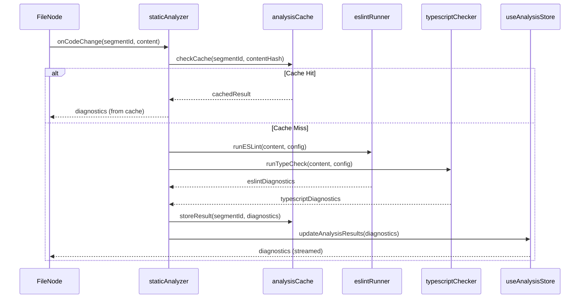

# Code Canvas - Architecture Overview

## Overview

Code Canvas is a visual code editor and repository viewer that allows users to import, visualize, edit, and collaborate on code repositories with AI-powered features. This design document covers the overall system architecture and specifically addresses the static code analysis feature that provides near-instant error and warning feedback for Node.js/JavaScript/TypeScript code segments.

## Architecture Diagram

```
┌─────────────────────────────────────────────────────────────────────────────┐
│                              CODE CANVAS                                     │
│                    Visual Code Editor & Repository Viewer                    │
└─────────────────────────────────────────────────────────────────────────────┘

┌─────────────────────────────────────────────────────────────────────────────┐
│                              FRONTEND (React + Vite)                         │
├─────────────────────────────────────────────────────────────────────────────┤
│                                                                              │
│  ┌─────────────┐    ┌──────────────────────────────────────────────────┐    │
│  │   main.tsx  │───▶│                    App.tsx                        │    │
│  │  (Entry)    │    │              ┌─────────────────┐                  │    │
│  └─────────────┘    │              │   CodeEditor    │                  │    │
│                     │              │  (Main Router)  │                  │    │
│                     │              └────────┬────────┘                  │    │
│                     └──────────────────────┼────────────────────────────┘    │
│                                            │                                 │
│  ┌─────────────────────────────────────────┼─────────────────────────────┐  │
│  │                         COMPONENTS      │                              │  │
│  │  ┌──────────────┐  ┌───────────────┐   │   ┌────────────────────┐    │  │
│  │  │ UploadScreen │  │  CodeCanvas   │◀──┴──▶│  ConflictResolver  │    │  │
│  │  │ (File/GitHub │  │  (ReactFlow   │       │  (Git Conflicts)   │    │  │
│  │  │   Import)    │  │   Visualizer) │       └────────────────────┘    │  │
│  │  └──────────────┘  └───────┬───────┘                                 │  │
│  │                            │                                          │  │
│  │  ┌──────────────┐  ┌───────┴───────┐   ┌────────────────────┐        │  │
│  │  │   FileNode   │  │  DrawingNode  │   │  ExplanationPanel  │        │  │
│  │  │ (Code View)  │  │  (Annotations)│   │  (AI Explanations) │        │  │
│  │  └──────────────┘  └───────────────┘   └────────────────────┘        │  │
│  │                                                                       │  │
│  │  ┌──────────────────┐  ┌───────────────────┐  ┌─────────────────┐    │  │
│  │  │ SegmentSwitcher  │  │RepoSegmentSelector│  │ ViewModeSelector│    │  │
│  │  │ (Category Filter)│  │ (Import Segments) │  │ (Full/Summary)  │    │  │
│  │  └──────────────────┘  └───────────────────┘  └─────────────────┘    │  │
│  └───────────────────────────────────────────────────────────────────────┘  │
│                                                                              │
│  ┌───────────────────────────────────────────────────────────────────────┐  │
│  │                           SERVICES (AI/API)                            │  │
│  │  ┌─────────────────┐  ┌──────────────────┐  ┌─────────────────────┐   │  │
│  │  │    gemini.ts    │  │ repoSeparator.ts │  │functionSummarizer.ts│   │  │
│  │  │ (AI Chat/Code)  │  │ (AI Categorize)  │  │  (Code Summaries)   │   │  │
│  │  └─────────────────┘  └──────────────────┘  └─────────────────────┘   │  │
│  │  ┌─────────────────┐  ┌──────────────────┐                            │  │
│  │  │ commandParser.ts│  │  searchEngine.ts │                            │  │
│  │  │ (Voice Commands)│  │  (File Search)   │                            │  │
│  │  └─────────────────┘  └──────────────────┘                            │  │
│  └───────────────────────────────────────────────────────────────────────┘  │
│                                                                              │
│  ┌───────────────────────────────────────────────────────────────────────┐  │
│  │                         STATE MANAGEMENT (Zustand)                     │  │
│  │  ┌─────────────────────────────┐  ┌─────────────────────────────────┐ │  │
│  │  │       useFileStore          │  │    useExplanationStore          │ │  │
│  │  │  • files[], drawings[]      │  │  • AI explanation state         │ │  │
│  │  │  • githubContext            │  │                                 │ │  │
│  │  │  • cachedRepoData           │  │                                 │ │  │
│  │  └─────────────────────────────┘  └─────────────────────────────────┘ │  │
│  └───────────────────────────────────────────────────────────────────────┘  │
│                                                                              │
│  ┌───────────────────────────────────────────────────────────────────────┐  │
│  │                              HOOKS                                     │  │
│  │  ┌─────────────────────────────┐  ┌─────────────────────────────────┐ │  │
│  │  │     useCollaboration        │  │    useVoiceRecognition          │ │  │
│  │  │  (Yjs + WebRTC P2P Sync)    │  │  (Web Speech API)               │ │  │
│  │  └─────────────────────────────┘  └─────────────────────────────────┘ │  │
│  └───────────────────────────────────────────────────────────────────────┘  │
│                                                                              │
└─────────────────────────────────────────────────────────────────────────────┘

┌─────────────────────────────────────────────────────────────────────────────┐
│                         BACKEND (Express + Socket.io)                        │
├─────────────────────────────────────────────────────────────────────────────┤
│  ┌─────────────────────────────────────────────────────────────────────┐    │
│  │                          server.js                                   │    │
│  │  • Room-based file sync (Socket.io)                                  │    │
│  │  • Real-time messaging                                               │    │
│  │  • In-memory room data storage                                       │    │
│  └─────────────────────────────────────────────────────────────────────┘    │
└─────────────────────────────────────────────────────────────────────────────┘

┌─────────────────────────────────────────────────────────────────────────────┐
│                           EXTERNAL INTEGRATIONS                              │
├─────────────────────────────────────────────────────────────────────────────┤
│  ┌──────────────┐  ┌──────────────┐  ┌──────────────┐  ┌──────────────┐    │
│  │  GitHub API  │  │  Gemini AI   │  │   Yjs/WebRTC │  │  Excalidraw  │    │
│  │  (Octokit)   │  │  (LLM)       │  │  (P2P Sync)  │  │  (Drawings)  │    │
│  └──────────────┘  └──────────────┘  └──────────────┘  └──────────────┘    │
└─────────────────────────────────────────────────────────────────────────────┘
```

## Components and Interfaces

### Frontend Components

| Component | Purpose |
|-----------|---------|
| `CodeEditor` | Main container, handles GitHub push/pull, download |
| `UploadScreen` | File/ZIP upload and GitHub import UI |
| `CodeCanvas` | ReactFlow-based visual code graph |
| `FileNode` | Individual file display with syntax highlighting |
| `DrawingNode` | Annotation/drawing overlay nodes |
| `ConflictResolver` | Git merge conflict resolution UI |
| `ExplanationPanel` | AI-generated code explanations |
| `SegmentSwitcher` | Filter files by category |
| `RepoSegmentSelector` | Select segments during import |
| `ViewModeSelector` | Toggle full/understanding view modes |

### Services

| Service | Purpose |
|---------|---------|
| `gemini.ts` | Gemini AI integration for chat/code assistance |
| `repoSeparator.ts` | AI-powered repository categorization |
| `functionSummarizer.ts` | Generate function/code summaries |
| `commandParser.ts` | Parse voice commands |
| `searchEngine.ts` | File and code search functionality |
| `staticAnalyzer.ts` | Static analysis orchestrator for ESLint and TypeScript checks |
| `eslintRunner.ts` | ESLint rule execution and configuration management |
| `typescriptChecker.ts` | TypeScript type checking via `tsc --noEmit` |
| `analysisCache.ts` | Caching layer for analysis results per commit/segment |

### State Stores (Zustand)

| Store | State |
|-------|-------|
| `useFileStore` | files, drawings, githubContext, cachedRepoData, viewMode |
| `useExplanationStore` | AI explanation panel state |
| `useAnalysisStore` | analysisResults, analysisConfig, isAnalyzing, analysisCache |

### Hooks

| Hook | Purpose |
|------|---------|
| `useCollaboration` | Yjs + WebRTC peer-to-peer sync for drawings |
| `useVoiceRecognition` | Web Speech API for voice commands |

## Data Models

### FileStructure
```typescript
interface FileStructure {
  name: string;
  path: string;
  content: string;
  language: string;
  analysis?: FileAnalysis;
  lastSyncedContent?: string;
}
```

### Drawing
```typescript
interface Drawing {
  id: string;
  type: 'freehand' | 'rectangle' | 'circle' | 'line' | 'text';
  points: { x: number; y: number }[];
  color: string;
  strokeWidth: number;
  text?: string;
}
```

### GitHubContext
```typescript
interface GitHubContext {
  owner: string;
  repo: string;
  branch: string;
  token?: string;
  sha?: string;
}
```

### AnalysisResult
```typescript
interface AnalysisResult {
  fileId: string;
  segmentId: string;
  diagnostics: Diagnostic[];
  timestamp: number;
  commitHash?: string;
}
```

### Diagnostic
```typescript
interface Diagnostic {
  severity: 'error' | 'warning' | 'info';
  message: string;
  source: 'eslint' | 'typescript';
  ruleId?: string;
  sourceRange: SourceRange;
}
```

### SourceRange
```typescript
interface SourceRange {
  filePath: string;
  startLine: number;
  startColumn: number;
  endLine: number;
  endColumn: number;
}
```

### AnalysisConfig
```typescript
interface AnalysisConfig {
  eslintEnabled: boolean;
  typescriptEnabled: boolean;
  eslintConfig?: object;
  tsconfigPath?: string;
}
```

## Key Data Flows

1. **File Import**: `UploadScreen` → ZIP/GitHub → `useFileStore` → `CodeCanvas`
2. **GitHub Sync**: `CodeEditor` ↔ Octokit API (push/pull with conflict resolution)
3. **Real-time Collab**: `useCollaboration` ↔ Yjs/WebRTC ↔ Peer clients
4. **AI Features**: Components → Gemini API → Explanations/Categorization
5. **Static Analysis**: `FileNode` (code change) → `staticAnalyzer.ts` → `useAnalysisStore` → `FileNode` (display diagnostics)

## Static Analysis Architecture

### Analysis Flow



### Security Model

- All analysis runs in the browser using WebAssembly-based ESLint and TypeScript
- No user code is executed; only AST parsing and static rule evaluation
- Optional sandbox runtime checks use isolated Web Workers with restricted APIs
- Rate limiting enforced at 10 requests per minute for sandbox operations

### Caching Strategy

- Cache key: `${commitHash}:${segmentId}:${contentHash}`
- Cache invalidation: On content change or configuration update
- Storage: IndexedDB for persistence across sessions

## Error Handling

- GitHub API errors surface via alerts with console logging
- AI service failures fall back to local categorization logic
- WebRTC connection status tracked via `useCollaboration` hook
- Static analysis errors are caught and displayed as warnings without blocking the editor
- ESLint/TypeScript configuration errors fall back to default configurations
- Analysis timeout (>500ms) triggers partial result display with retry option

## Testing Strategy

- Unit tests for services (repoSeparator, codeAnalyzer, staticAnalyzer, eslintRunner, typescriptChecker)
- Component tests for UI interactions including diagnostic display in FileNode
- Integration tests for GitHub sync flow
- Integration tests for end-to-end analysis flow (code change → diagnostics display)
- Security tests to verify no code execution during analysis

## Tech Stack

| Layer | Technology |
|-------|------------|
| Frontend | React 18 + TypeScript + Vite |
| Visualization | ReactFlow |
| State | Zustand |
| Collaboration | Yjs + WebRTC |
| Styling | Tailwind CSS |
| Backend | Express + Socket.io |
| AI | Google Gemini API |
| Git Integration | Octokit (GitHub API) |
